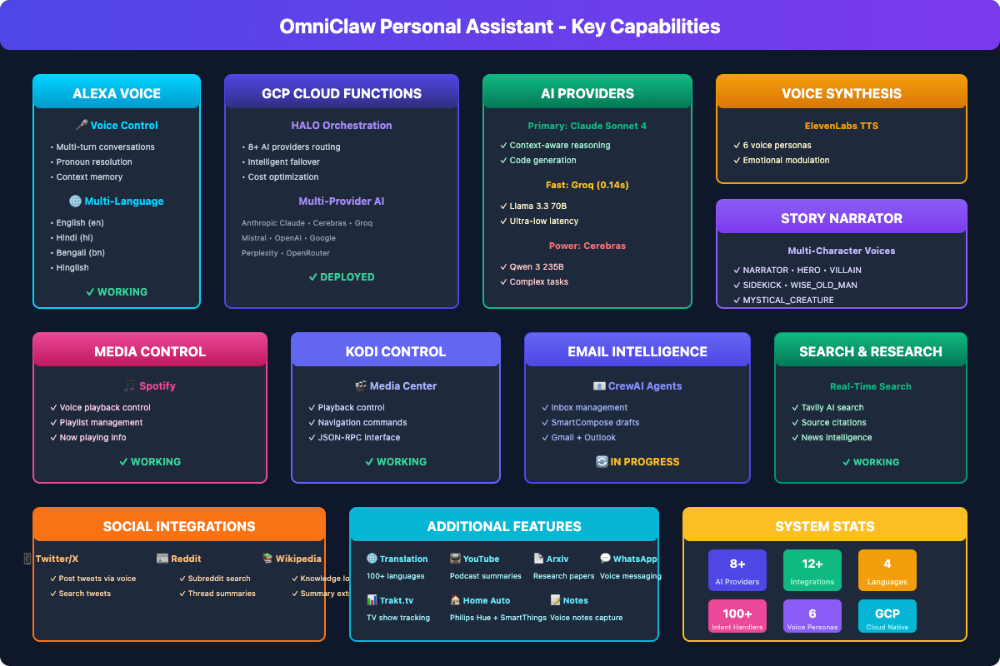

# OmniClaw Personal Assistant

<div align="center">

**AI-Powered Multi-Platform Personal Assistant with Voice Control**

[](https://opensource.org/licenses/MIT)
[](#)
[](#)


</div>

---

## Overview

OmniClaw is a production-grade personal assistant that unifies multiple AI capabilities across platforms including Alexa, WhatsApp, and web interfaces. Built with resilience and multi-provider AI routing.

### Key Features

- **Multi-Channel Support**: Alexa, WhatsApp, Web - unified experience
- **AI Orchestration**: HALO-style routing across multiple LLM providers
- **Vision-Language Tagging**: Automatic content tagging for searchable vault
- **Voice Control**: Natural language commands via Alexa
- **Multi-Language Support**: English, Hindi (हिंदी), Bengali (বাংলা), Hinglish
- **Self-Healing**: Circuit breaker pattern with automatic failover
- **Knowledge Graph**: Cross-session learning and semantic search
- **Persona-Based Responses**: Named AI characters with distinct personalities

---

## Architecture

```
OmniClaw
├── 🌐 Cloud Functions (GCP)
│   ├── HALO Orchestration
│   ├── Multi-Provider AI Routing
│   └── Circuit Breaker Resilience
├── 🎭 Persona System
│   └── Per-capability named personas
├── 📡 Platform Handlers
│   ├── Alexa Handler
│   ├── WhatsApp Handler
│   └── REST API
├── 🔍 Vault Search
│   └── Knowledge Graph Intent
└── 🛡️ Reliability
    └── Self-Healing Architecture
```

---

## Capabilities

| Intent | Description | Persona |
|--------|-------------|---------|
| **WikipediaIntent** | Factual queries from Wikipedia | Dr. Fact (45) |
| **NewsIntent** | News aggregation and summaries | NewsBot (30) |
| **TranslationIntent** | Multi-language translation | Poly (28) |
| **StoryIntent** | AI storytelling with characters | StoryWeaver (35) |
| **ArxivIntent** | Research paper search | Prof. Research (50) |
| **YouTubeIntent** | Video search and info | StreamGuide (25) |
| **SpotifyIntent** | Music playback control | DJ Vibe (27) |
| **KodiIntent** | Media center control | MediaMaster (33) |
| **KnowledgeGraphIntent** | Vault search across saved content | Sage (40) |
| **GeneralIntent** | Web search and general queries | Sage (40) |

### Multi-Language Support

| Language | Code | Status | Example |
|----------|------|--------|---------|
| **English** | en | ✅ Full | "What's the weather?" |
| **Hindi** | hi | ✅ Full | "आज मौसम कैसा है?" |
| **Bengali** | bn | ✅ Full | "আজকের আবহাওয়া কেমন?" |
| **Hinglish** | hi-en | ✅ Full | "Aaj weather kaisa hai?" |

### Voice Personas

Each voice capability uses a distinct persona style:

| Capability | Persona | Accent | Description |
|------------|---------|--------|-------------|
| **Story Narrator** | StoryWeaver | Indian-English | Animated, expressive storytelling |
| **Weather** | Sage | Neutral | Clear, professional forecasts |
| **Music Control** | DJ Vibe | Casual | Energetic, music-focused |
| **General** | Sage | Balanced | Calm, helpful assistant |

---

## Quick Start

### Prerequisites

- Node.js 18+
- GCP credentials (for Cloud Functions)
- API keys for AI providers

### Installation

```bash
# Install dependencies
npm install

# Configure environment
cp .env.example .env
# Edit .env with your API keys

# Deploy to GCP
cd infrastructure/cloud-functions/deploy
gcloud functions deploy alexa_handler --runtime nodejs18 ...
```

---

## Project Structure

```
omniclaw-personal-assistant/
├── infrastructure/
│   ├── cloud-functions/     # GCP Cloud Functions
│   │   └── deploy/
│   │       ├── index.js           # Main handler
│   │       ├── shared/            # Shared modules
│   │       │   ├── persona/       # Persona generator
│   │       │   └── halo/          # HALO orchestration
│   │       └── clients/          # Platform clients
│   ├── firestore/           # Database schemas
│   ├── monitoring/          # Grafana dashboards
│   ├── terraform/           # Infrastructure as code
│   └── vault-search-service/# Search service
├── tests/                   # Test suite
├── learning_base/          # ML models and analysis
└── apps/                   # Supporting applications
```

---

## Configuration

### Environment Variables

```bash
# AI Providers (via Z.ai proxy recommended)
ANTHROPIC_API_KEY=sk-ant-xxx
CEREBRAS_API_KEY=csk-xxx
GROQ_API_KEY=gsk_xxx

# GCP
GCP_PROJECT=your-project
GCP_REGION=asia-south1

# Database
FIRESTORE_EMULATOR_HOST=localhost:8080
```

### Capability Personas

Each AI capability has a named persona with distinct personality:

- **Dr. Fact** (Wikipedia): Technical, precise, scholarly
- **NewsBot** (News): Professional, informative
- **Poly** (Translation): Friendly, helpful
- **StoryWeaver** (Stories): Creative, imaginative
- **Prof. Research** (Arxiv): Expert, analytical
- **StreamGuide** (YouTube): Friendly, casual
- **DJ Vibe** (Spotify): Friendly, energetic
- **MediaMaster** (Kodi): Professional, media-focused
- **Sage** (General/Vault): Professional, balanced

---

## Testing

```bash
# Run unit tests
npm test

# Run integration tests
npm run test:integration

# Test specific capability
npm test -- --grep "WikipediaIntent"
```

---

## Documentation

- [Capabilities Architecture](docs/architecture.png) - Visual overview of all capabilities
- [System Architecture](docs/architecture/SYSTEM_ARCHITECTURE.md) - Detailed technical architecture
- [Persona System](infrastructure/cloud-functions/deploy/shared/persona/)
- [HALO Orchestration](infrastructure/cloud-functions/deploy/shared/halo/)

### Try It

**Story Narrator Demo**: Ask Alexa to "tell me a story about a brave warrior and a wise dragon" to hear the persona-based multi-character narration in action.



---

## License

MIT License - see [LICENSE](LICENSE) file for details.

---

<div align="center">

**Built with TreeQuest AI** | **Multi-Provider AI Orchestration**

</div>
