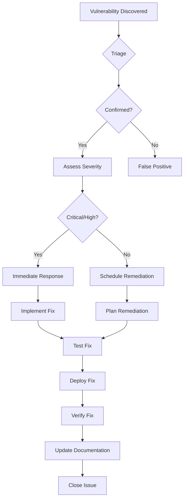

# OmniClaw Enhanced - Vulnerability Management
# Version: 1.0.0
# Last Updated: 2026-03-27

## Table of Contents
1. [Overview](#overview)
2. [Vulnerability Identification](#vulnerability-identification)
3. [Vulnerability Assessment](#vulnerability-assessment)
4. [Vulnerability Remediation](#vulnerability-remediation)
5. [Vulnerability Reporting](#vulnerability-reporting)
6. [Tools and Automation](#tools-and-automation)
7. [Procedures and Workflows](#procedures-and-workflows)
8. [Vulnerability Database](#vulnerability-database)

---

## Overview

### What is Vulnerability Management?

Vulnerability management is the continuous process of identifying, assessing, treating, and reporting security vulnerabilities in systems and software.

### Objectives

- **Identify** vulnerabilities before attackers exploit them
- **Assess** risk and prioritize remediation
- **Remediate** vulnerabilities in a timely manner
- **Report** on vulnerability status and trends
- **Prevent** future vulnerabilities through secure practices

### Scope

This vulnerability management program covers:
- Application code and dependencies
- Infrastructure and configuration
- Third-party services and APIs
- Cloud platforms (GCP)
- Network security

---

## Vulnerability Identification

### Automated Scanning

**Dependency Scanning:**
```bash
# npm audit (JavaScript dependencies)
npm audit --audit-level=moderate
npm audit fix

# Snyk (alternative)
npm install -g snyk
snyk test
snyk monitor

# WhiteSource (enterprise)
npm install -g whitesource
whitesource scan
```

**Static Application Security Testing (SAST):**
```bash
# Semgrep
npm install -g semgrep
semgrep --config=auto

# SonarQube
docker run -d --name sonarqube -p 9000:9000 sonarqube
sonar-scanner

# CodeQL
codeql database analyze <database> --format=sarif-latest --output=results.sarif
```

**Dynamic Application Security Testing (DAST):**
```bash
# OWASP ZAP
docker run -t owasp/zap2docker-stable zap-baseline.py -t https://example.com

# Nuclei
nuclei -u https://example.com -t /path/to/templates

# Nikto
nikto -h https://example.com
```

**Container Scanning:**
```bash
# Trivy
trivy image omniclaw:latest

# Clair
clairctl scan omniclaw:latest

# Docker Scout
docker scout cves omniclaw:latest
```

### Manual Testing

**Code Review Checklist:**
- [ ] Input validation and sanitization
- [ ] Output encoding
- [ ] Authentication and authorization
- [ ] Session management
- [ ] Cryptographic practices
- [ ] Error handling
- [ ] Logging and monitoring
- [ ] API security
- [ ] Database security
- [ ] File handling

**Penetration Testing:**
- [ ] Quarterly external penetration tests
- [ ] Annual internal penetration tests
- [ ] Continuous automated testing
- [ ] Red team exercises (annually)

### Threat Intelligence

**Sources:**
- CVE Database (https://cve.mitre.org/)
- NVD (https://nvd.nist.gov/)
- CISA Known Exploited Vulnerabilities
- Vendor security advisories
- Security mailing lists
- Dark web monitoring

---

## Vulnerability Assessment

### Severity Classification

**CVSS Scoring:**

| Score | Severity | Response Time |
|-------|----------|---------------|
| 9.0-10.0 | Critical | 24 hours |
| 7.0-8.9 | High | 7 days |
| 4.0-6.9 | Medium | 30 days |
| 0.1-3.9 | Low | 90 days |

**Custom Risk Scoring:**

```
Risk Score = (CVSS Score) × (Exploitability) × (Asset Criticality) × (Environmental Factor)
```

**Factors:**
- **CVSS Score**: Base severity from NVD
- **Exploitability**: PoC available, active exploitation, weaponized
- **Asset Criticality**: Public-facing, internal, non-production
- **Environmental Factor**: Compensating controls, exposure

### Vulnerability Prioritization

**P1 - Critical (Immediate Action):**
- Remote code execution (RCE)
- SQL injection
- Authentication bypass
- Known exploited vulnerabilities
- Public-facing systems

**P2 - High (Action Within 7 Days):**
- Stored XSS
- Privilege escalation
- Sensitive data exposure
- CSRF in critical functions
- Insecure direct object references

**P3 - Medium (Action Within 30 Days):**
- Reflected XSS
- Session management issues
- Missing security headers
- Insecure configuration
- Information disclosure

**P4 - Low (Action Within 90 Days):**
- Self-XSS
- Minor information disclosure
- Missing best practices
- Code quality issues

### Assessment Process

1. **Triage**
   - Verify vulnerability exists
   - Confirm scope and impact
   - Identify affected systems
   - Determine exploitability

2. **Analyze**
   - Review CVSS score
   - Check for known exploits
   - Assess business impact
   - Identify remediation options

3. **Prioritize**
   - Apply risk scoring
   - Determine severity level
   - Assign priority
   - Schedule remediation

---

## Vulnerability Remediation

### Remediation Strategies

**1. Patching**
- Apply vendor patches
- Update dependencies
- Upgrade to secure versions
- Test patches before deployment

**2. Mitigation**
- Implement compensating controls
- Add WAF rules
- Implement network segmentation
- Increase monitoring

**3. Acceptance**
- Document risk acceptance
- Obtain management approval
- Implement additional monitoring
- Schedule future remediation

**4. Avoidance**
- Disable vulnerable feature
- Restrict access (whitelist IPs)
- Decommission system
- Use alternative solution

### Patch Management

**Process:**
1. **Identify** available patches
2. **Test** in development/staging
3. **Schedule** maintenance window
4. **Deploy** patches
5. **Verify** patch effectiveness
6. **Monitor** for issues
7. **Document** changes

**Testing:**
- Unit tests
- Integration tests
- End-to-end tests
- Security regression tests
- Performance tests

### Code Fixes

**Example Vulnerability Fix:**

```javascript
// ❌ VULNERABLE: SQL Injection
async function getUser(id) {
  const query = `SELECT * FROM users WHERE id = '${id}'`;
  return db.execute(query);
}

// ✅ SECURE: Parameterized Query
async function getUser(id) {
  const query = 'SELECT * FROM users WHERE id = ?';
  return db.execute(query, [id]);
}
```

```javascript
// ❌ VULNERABLE: XSS
app.get('/search', (req, res) => {
  const results = search(req.query.q);
  res.send(`<div>Results: ${results}</div>`);
});

// ✅ SECURE: Output Encoding
app.get('/search', (req, res) => {
  const results = search(req.query.q);
  res.send(`<div>Results: ${escapeHtml(results)}</div>`);
});
```

### Rollback Procedures

**Pre-deployment:**
- Create backup
- Document current state
- Prepare rollback script
- Test rollback procedure

**Post-deployment issues:**
1. Monitor for errors
2. Check performance metrics
3. Review security logs
4. Rollback if critical issues
5. Investigate and retry

---

## Vulnerability Reporting

### Report Structure

**Executive Summary:**
- Total vulnerabilities found
- Critical/high count
- Remediation progress
- Risk trends

**Detailed Findings:**
```json
{
  "id": "VULN-2026-001",
  "title": "Remote Code Execution in lodash",
  "severity": "critical",
  "cvss_score": 9.8,
  "cve": "CVE-2021-23337",
  "affected_component": "package.json",
  "description": "The affected version of lodash is vulnerable to RCE...",
  "exploitability": "high",
  "impact": "attacker can execute arbitrary code",
  "remediation": "Update to lodash >= 4.17.21",
  "references": [
    "https://nvd.nist.gov/vuln/detail/CVE-2021-23337"
  ],
  "discovered_date": "2026-03-27",
  "remediation_due": "2026-03-28",
  "status": "in_progress",
  "assigned_to": "security-team"
}
```

### Reporting Cadence

**Daily:**
- New critical vulnerabilities
- Remediation progress
- Exploit attempts

**Weekly:**
- Vulnerability summary
- Remediation metrics
- Trend analysis

**Monthly:**
- Comprehensive vulnerability report
- Risk assessment
- Process improvements
- Training recommendations

**Quarterly:**
- Executive dashboard
- Compliance status
- Third-party risk
- Penetration test results

### Metrics and KPIs

**Key Metrics:**
- Mean Time to Detect (MTTD)
- Mean Time to Remediate (MTTR)
- Vulnerability backlog
- Remediation success rate
- Recurring vulnerabilities

**Targets:**
- Critical: < 24 hours
- High: < 7 days
- Medium: < 30 days
- Low: < 90 days

---

## Tools and Automation

### Automated Scanning Tools

**SAST Tools:**
- Semgrep (open source)
- SonarQube (community/enterprise)
- CodeQL (GitHub)
- Checkmarx (commercial)

**DAST Tools:**
- OWASP ZAP (open source)
- Burp Suite (commercial)
- Nuclei (open source)
- Nessus (commercial)

**Dependency Scanning:**
- npm audit (built-in)
- Snyk (free/paid)
- WhiteSource (commercial)
- Dependabot (GitHub)

**Container Security:**
- Trivy (open source)
- Clair (open source)
- Docker Scout (free)
- Aqua Security (commercial)

### CI/CD Integration

**GitHub Actions Example:**
```yaml
name: Security Scan

on:
  push:
    branches: [ main, develop ]
  pull_request:
    branches: [ main ]
  schedule:
    - cron: '0 0 * * 0' # Weekly

jobs:
  security-scan:
    runs-on: ubuntu-latest

    steps:
    - uses: actions/checkout@v3

    - name: Run npm audit
      run: npm audit --audit-level=moderate

    - name: Run Snyk
      uses: snyk/actions/node@master
      env:
        SNYK_TOKEN: ${{ secrets.SNYK_TOKEN }}

    - name: Run Semgrep
      uses: returntocorp/semgrep-action@v1

    - name: Upload SARIF
      uses: github/codeql-action/upload-sarif@v2
      with:
        sarif_file: results.sarif
```

### Automated Remediation

**Dependency Updates:**
```yaml
# Dependabot configuration
version: 2
updates:
  - package-ecosystem: "npm"
    directory: "/"
    schedule:
      interval: "weekly"
    open-pull-requests-limit: 10
    reviewers:
      - "security-team"
    labels:
      - "dependencies"
      - "security"
```

---

## Procedures and Workflows

### Vulnerability Discovery Workflow



### Emergency Vulnerability Response

**For Critical Vulnerabilities:**

1. **Immediate (0-1 hour)**
   - Assemble incident response team
   - Initial vulnerability assessment
   - Implement emergency mitigations
   - Notify stakeholders

2. **Short-term (1-24 hours)**
   - Detailed vulnerability analysis
   - Develop remediation plan
   - Test remediation in staging
   - Deploy fix to production

3. **Post-incident (1-7 days)**
   - Verify remediation effectiveness
   - Conduct root cause analysis
   - Update security processes
   - Document lessons learned

### Vulnerability Disclosure

**Responsible Disclosure Process:**

1. **Report Submission**
   - Security email: security@omniclaw.example.com
   - PGP key available for encryption
   - Expected response: 48 hours

2. **Report Review**
   - Security team triages report
   - Confirms vulnerability
   - Assigns severity rating
   - Responds to reporter

3. **Remediation**
   - Fix is developed
   - Testing conducted
   - Patch deployed
   - Verification completed

4. **Disclosure**
   - Coordinate with reporter
   - Publish security advisory
   - Credit reporter (if desired)
   - Update CVE database

**Bug Bounty Program:**
- Platform: HackerOne / Bugcrowd
- Rewards: $100 - $10,000
- Scope: *.omniclaw.example.com
- Rules: No destructive testing

---

## Vulnerability Database

### Tracking Template

**Vulnerability Record:**
```json
{
  "id": "VULN-2026-001",
  "title": "SQL Injection in User Search",
  "discovered_date": "2026-03-27T10:00:00Z",
  "reported_by": "security-team",
  "severity": "high",
  "cvss_score": 8.6,
  "cvss_vector": "CVSS:3.1/AV:N/AC:L/PR:N/UI:N/S:U/C:H/I:H/A:H",
  "cve": null,
  "cwe": "CWE-89",

  "affected_systems": [
    "omniclaw-analytics",
    "omniclaw-price"
  ],

  "description": "SQL injection vulnerability in user search functionality allows attackers to execute arbitrary SQL queries...",

  "proof_of_concept": "https://github.com/omniclaw/pocs/blob/main/vuln-001.md",

  "exploitability": {
    "score": "high",
    "weaponized": false,
    "active_exploitation": false,
    "poc_available": true
  },

  "impact": {
    "confidentiality": "high",
    "integrity": "high",
    "availability": "medium",
    "business_impact": "High - unauthorized data access"
  },

  "remediation": {
    "recommended_action": "Patch application code",
    "alternative_action": "Implement WAF rules",
    "workaround": "Disable user search feature",
    "patch_available": true,
    "patch_version": "1.2.3",
    "estimated_effort": "4 hours"
  },

  "status": "in_progress",
  "assigned_to": "john.doe",
  "due_date": "2026-04-03T00:00:00Z",

  "timeline": [
    {
      "date": "2026-03-27T10:00:00Z",
      "action": "Vulnerability discovered",
      "user": "security-team"
    },
    {
      "date": "2026-03-27T14:00:00Z",
      "action": "Issue created in tracker",
      "user": "security-team"
    },
    {
      "date": "2026-03-28T09:00:00Z",
      "action": "Fix implemented",
      "user": "john.doe"
    },
    {
      "date": "2026-03-28T14:00:00Z",
      "action": "Deployed to production",
      "user": "ops-team"
    }
  ],

  "references": [
    "https://cwe.mitre.org/data/definitions/89.html",
    "https://owasp.org/www-community/attacks/SQL_Injection"
  ],

  "tags": [
    "sql-injection",
    "database",
    "authentication"
  ]
}
```

### Dashboard Metrics

**Real-time Dashboard:**
- Open vulnerabilities by severity
- Average age of open vulnerabilities
- Remediation success rate
- Vulnerability trends (30/60/90 days)
- Top vulnerable components

---

## Continuous Improvement

### Process Reviews

**Quarterly Reviews:**
- Assess program effectiveness
- Review key metrics
- Identify improvement areas
- Update procedures
- Train team members

**Annual Assessments:**
- Comprehensive program audit
- Benchmark against industry standards
- Update tools and technologies
- Revise policies and procedures
- Set goals for next year

### Training and Awareness

**Required Training:**
- Secure coding practices
- Vulnerability identification
- Remediation procedures
- Tool usage and automation
- Incident response

**Frequency:**
- Developers: Quarterly
- Security Team: Monthly
- Management: Bi-annual

### Lessons Learned

**Post-Incident Review:**
- What happened?
- Why did it happen?
- What was the impact?
- How was it resolved?
- What can we improve?

**Action Items:**
- Update security processes
- Enhance training
- Improve tooling
- Modify architecture

---

## Conclusion

Effective vulnerability management is critical for maintaining the security posture of OmniClaw Enhanced. By following this comprehensive program, we can:

- **Reduce risk** through proactive identification and remediation
- **Respond quickly** to emerging threats
- **Maintain compliance** with security standards
- **Build trust** with users and stakeholders
- **Continuously improve** our security posture

### Key Success Factors

1. **Executive Support** - Resources and authority
2. **Automated Tools** - Scalability and efficiency
3. **Skilled Team** - Expertise and experience
4. **Clear Processes** - Consistency and repeatability
5. **Continuous Monitoring** - Visibility and awareness
6. **Rapid Response** - Minimizing exposure time

---

**Document Control**

- **Version:** 1.0.0
- **Author:** Security Team
- **Last Updated:** 2026-03-27
- **Next Review:** 2026-09-27
- **Approver:** CISO
